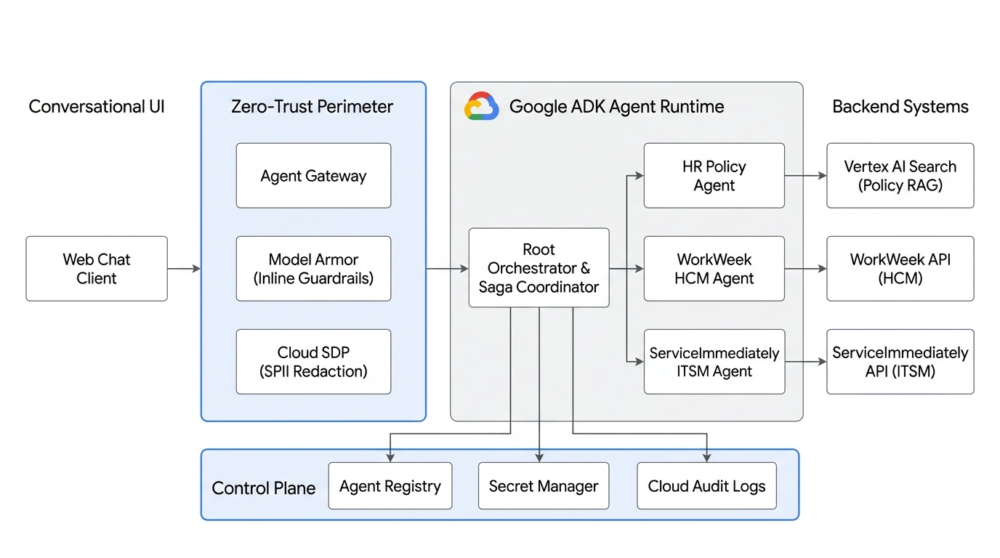

# HR Agentic Solution (MVP 1) - Elevate Team 7

Google Cloud **Gemini Enterprise Agent Platform** および **Google Agent Development Kit (ADK)** を基盤とした、エンタープライズ人事・ITサポート向け自律型バーチャルアシスタント（MVP 1）のリポジトリです。

---

## 📄 ドキュメント (Specifications)

* **[Solution Design Document (SDD v1.1 - Approved)](docs/SDD.md)**
  * **Google Docs 版**: [HR Agentic Solution - Solution Design Document (MVP 1)](https://docs.google.com/document/d/1fpEXG8knc_IoNLCiCuv_F-6_xPuMuqsH3KsTEl7iu9M/edit)
  * **Business Requirements Document (BRD)**: [HR Agentic Solution BRD](https://docs.google.com/document/d/1B46ERMVZapwSN8RPmsJ0_NnayuUkaTT6ZcujgwdjTX8/edit?resourcekey=0-kwi-DdO3wHIdEk8gtbpeQQ&tab=t.tpcr3esq94y#heading=h.imkwl950mppq)

---

## 🏗️ システムアーキテクチャ概要 (Target Architecture)

### コアコンポーネント
1. **Zero-Trust Security & Governance Perimeter**:
   * **Gemini Enterprise Agent Gateway**: 認証・認可強制、レートリミット。
   * **Model Armor**: インライン入出力検証（Prompt Injection / Jailbreak 防御、ドメイン外質問ブロック、出力ハルシネーション抑止）。
   * **Cloud Sensitive Data Protection (Basic SDP)**: SPII（電話番号、自宅住所、マイナンバー/SSN等）のインライン検知・マスキング（追加遅延 < 300ms）。
2. **Google ADK Hierarchical Multi-Agent Runtime**:
   * **Root Orchestrator Agent**: 意図解釈（NLU）、マルチターン状態管理（`session` vs `temp`）、および複合ワークフローの **Deterministic Saga Coordinator**。
   * **HR Policy Specialist Agent**: **Vertex AI Search** と連携し、承認済み規程のみを根拠に回答生成（Strict Grounding >= 0.75 & Deep Link Citations）。
   * **WorkWeek HCM Specialist Agent**: プロファイルおよび休暇残高の**都度リアルタイム取得（キャッシュ禁止）**と、残高超過・過去日申請を防ぐ決定論的ガードレール。
   * **ServiceImmediately ITSM Specialist Agent**: インシデントチケット管理、`X-Automation-Origin` 監査ヘッダー強制注入、およびステータス遷移・重複起票ガードレール。
3. **Enterprise AI Governance**:
   * **Agent Registry**: 許可ツール（Function Schemas）の厳格な Allowlisting とバージョン管理。
   * **Cloud Audit Logs & Trace**: 許可・ブロックされた全アクションの100%監査証跡。
